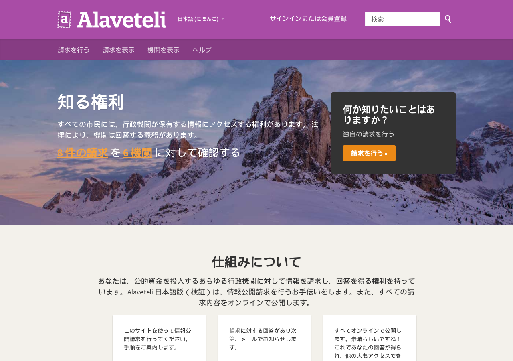

# alaveteli-jp

[Alaveteli](https://github.com/mysociety/alaveteli)（英国 mySociety が開発する、情報公開請求をオンラインで行い、請求文と行政機関からの回答を公開するオープンソース。英国 WhatDoTheyKnow の中身。AGPL-3.0）を **日本語で使うための非公式リポジトリ** です。

- `locale/ja/app.po` — 本家 `app.pot`（1,553 文字列）の日本語訳。プレースホルダ（`{{name}}`・HTMLタグ・URL・改行）は原文と同一であることを機械検証済み
- `docker-compose.override.yml` — 公式の開発用 Docker にポートを足したもの
- `scripts/translate_po_gemma.py` — 未訳エントリをローカルLLM（gemma4）で訳し、プレースホルダ不一致を不採用にする翻訳スクリプト

本家への翻訳提案は mySociety の方針どおり Transifex 経由が正式ルートです。あわせて本家へ Pull Request #9527 を出しています。本家に取り込まれた分は本家の翻訳が正となり、本リポジトリは差分の保守にとどめます。

**本リポジトリは mySociety および Alaveteli プロジェクトとは無関係の非公式なものです。** 日本の情報公開法・各自治体の情報公開条例に沿った運用は、導入する団体の責任で行ってください。

## 使い方（Docker・開発用構成）

```bash
git clone https://github.com/katsushi2441/alaveteli-jp.git
cd alaveteli-jp
./docker/setup          # 初回のみ（イメージ構築・gem・DB）
# config/general.yml で AVAILABLE_LOCALES: "ja en" / DEFAULT_LOCALE: ja にする
./docker/server
```

`http://<ホスト>:18383/` で日本語の Alaveteli が開きます（翻訳を差し替えたら `docker compose restart app sidekiq`）。



## 導入キット

手順書・落とし穴・AI指示書を1つにした導入キット（5,500円税込）: https://kappstore.exbridge.jp/app.php?id=025aa9bee5dd411e

## 解説記事

- 導入と日本語化の実録: https://katsushi2441.github.io/vwork/articles/2026-09-07-alaveteli-japanese-guide.html

## ライセンス

翻訳・スクリプトは Alaveteli 本体と同じ AGPL-3.0 で提供します。翻訳の著作権は株式会社エクスブリッジ（小嶋 篤）に帰属し、本家プロジェクトへの取り込みを妨げません。
